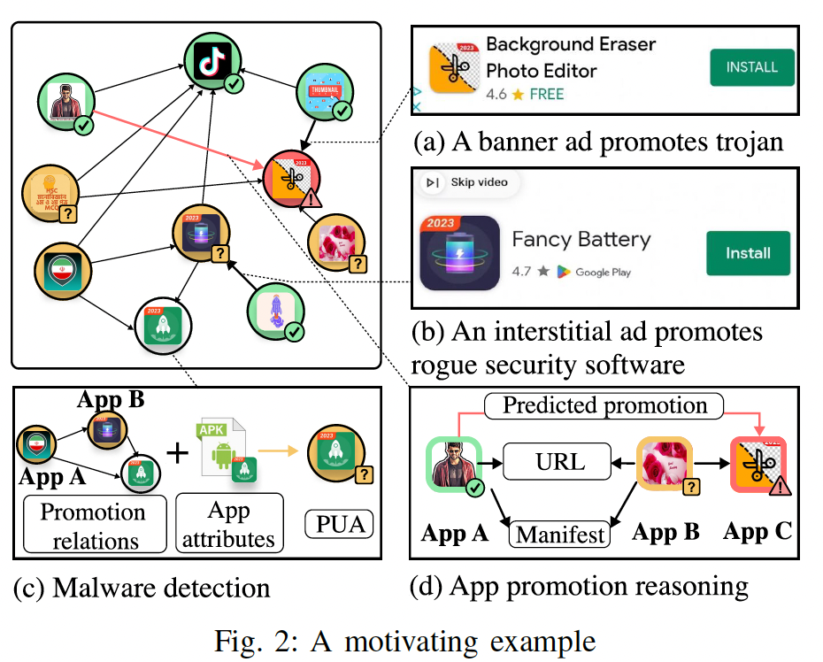
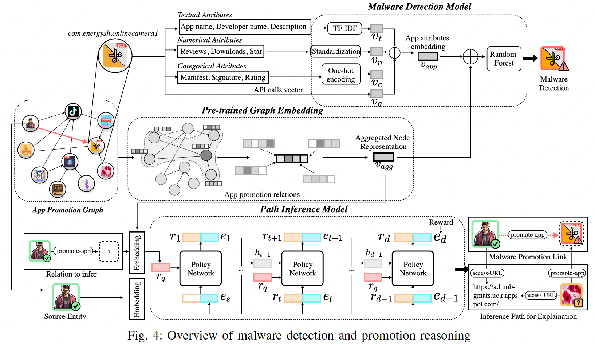

## AdGPE

### Overview

This repo stores the source code and dataset of AdGPE (NDSS 2025). AdGPE synergistically integrates app UI exploration with graph
learning to automatically collect app promotion ads (***App Promotion Graph Construction***), detect malware promoted by these ads (***Malware Detection***), and explain the promotion mechanisms employed by the detected malware (***App Promotion Reasoning***).

### App Promotion Graph Construction 

We have pinpointed three majorchallenges of this task. 

1. First, app promotion ads are often placed on multiple UI pages within an app. Existing UI exploration techniques aim at achieving high code coverage withina single app by employing complex and heavy strategies,which become inefficient when scaling to a large numberof apps.
2. Second, app promotion ads appear in various formats, each with distinct UI layout characteristics. Current works on identifying mobile ads arelimited to a small set of UI widgets thus failing to captureall the app promotion ads.
3. Third, ads’ content is generated at runtime and continuously changes over time. Existing UI exploration techniques are optimized on code coverage so they tend to avoid repeated actions and may overlook the changed ad content.

To address these three challenges, ADGPE includes a novel ad-oriented UI exploration technique. 

1. First, to efficiently achieve high ad coverage, this technique employs random exploration combined with a depth-first exhaustive search strategy. 
2. Second,to accurately identify various ad types, this technique leverages a common design feature: a call-to-action widget redirecting users to the app marketplace. 
3. Third, to capture the frequently updated ad content, this ad-oriented UI exploration technique periodically restarts apps and refreshes their ads to capture allavailable content within a period of time.

Please refer to the [App Promotion Graph Construction](App Promotion Graph Construction/) folder to check our code.

### 

### Malware Detection & App Promotion Reasoning

The second part of ADGPE is to leverage the constructed app promotion graph for ad-promoted malware detection. Existing Android malware detection models have two shortcomings when detecting ad-promoted malware

1. First, they are ineffective as they mainly train learning models using only app attributes (e.g., permissions, app metadata,and API calls) and overlook the app promotion relations. 
2. Second, these models generally lack explainability. To address these shortcomings, ADGPE introduces a novel graphlearning model based on pre-trained Graph Neural Network (GNN) [55], [40], [98], [49]. 

To effectively detect ad-promoted malware, **this model constructs an embedding of the app promotion graph to represent app promotion relations**. 

- This embedding is then combined with the app attributes to traina Random Forest classifier [46] for malware detection. 
- To enhancethe explainability of our model, ADGPE transforms theapp promotion graph into a promotion inference graph (PIG) and builds a path inference model to infer malware promotion mechanisms based on app attributes and app promotion relations. The path inference model also predicts unobserved links in the app promotion graph, complementing UI exploration to build a more comprehensive app promotion graph for better detection and inference.

Please refer to the [Malware Detection](Malware Detection/) and  [App Promotion Reasoning](App Promotion Reasoning/) folder to check our code.

### Publication

Shang Ma, Chaoran Chen, Shao Yang, Shifu Hou, Toby Jia-Jun Li, Xusheng Xiao, Tao Xie, Yanfang Ye. "Careful About What App Promotion Ads Recommend! Detecting and Explaining Malware Promotion via App Promotion Graph." Network and Distributed System Security (**NDSS 2025**) 

### Dataset
The dataset is available in this [link](https://drive.google.com/drive/folders/1H5AhXpDOo3R_-uHEjHxMDpHGoMdVneWh?usp=drive_link).
You can also request by emailing the authors. We welcome any question and collaboration.